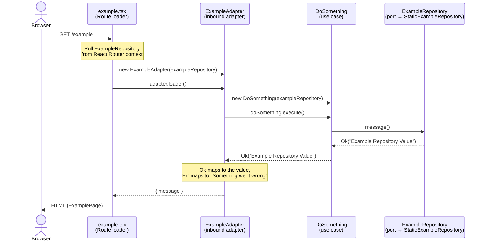

# New React Router App

## Getting Started

### Installation

Install the dependencies:

```bash
npm install
```


### Development

Start the development server:

```bash
npm run dev
```

Your application will be available at `http://localhost:8080`.


## Architecture

This template follows a hexagonal (ports and adapters) structure.
The core holds the application logic and knows nothing about React Router or Express.
The framework reaches it through adapters.

```
core/
  result.ts                                        Result type used across the core
  ports/example-repository.ts                      outbound port, an interface the core depends on
  use-cases/do-something.ts                        a use case

app/
  adapters/inbound/example-adapter.ts              inbound adapter, drives a use case from a route
  adapters/outbound/static-example-repository.ts   outbound adapter, implements the port
  context.ts                                       the port made available to loaders
  routes/example.tsx                               route that calls the inbound adapter
server/app.ts                                      composition root, wires the outbound adapter in
```

Terms:

- **Core**.
  The domain and use cases.
  It has no framework imports, so it runs and tests on its own.
- **Port**.
  An interface the core owns.
  An outbound port like `ExampleRepository` is a dependency the core needs.
  The core defines it and an adapter implements it.
- **Adapter**.
  Concrete code at the edge.
  An inbound adapter turns a request into a use-case call.
  An outbound adapter satisfies an outbound port, for example data access.
- **Composition root**.
  The one place that builds concrete adapters and hands them in.
  Here it is `server/app.ts`, which puts the outbound adapter into the router context.


### Conventions

- **Use cases** are classes with an `execute` method.
  Ports arrive through the constructor, request-specific data through `execute`.
- **Results, not exceptions.**
  Use cases and ports return a `Result` (`Ok<T> | Err<E>`), so success and failure are both explicit at the call site.
  Errors are tagged objects, for example `{ type: "unknown"; detail: Error }`.
- **Ports are outbound only.**
  The core defines interfaces for what it needs from the outside, like `ExampleRepository`.
  It defines no incoming port interfaces.
  An inbound adapter calls use cases directly instead of going through a shared interface, which keeps those interfaces from growing into large surfaces that change on every new operation.
  The dependency direction is unchanged, the outside depends on the inside.


### Request flow

The request path for `/example` runs inward, then back out through a port:

```
route loader -> ExampleAdapter (inbound) -> DoSomething (use case) -> ExampleRepository (outbound port) -> StaticExampleRepository (outbound adapter)
```



Each layer tests on its own. Use cases test against fake repositories, the inbound adapter tests with the same fakes, and routes test with React Router's `createRoutesStub`.


### Extending

#### A new use case

1. Add a class in `core/use-cases/`, taking its ports through the constructor and request data through `execute`.
2. Unit test it with a double from `tests/core/doubles/`.
3. Call it from an inbound adapter in `app/adapters/inbound/`.


#### A new port

1. Define the interface in `core/ports/`.
2. Implement an outbound adapter in `app/adapters/outbound/`.
3. Expose it through a context in `app/context.ts`.
4. Wire the concrete adapter in `server/app.ts`.
5. Add a double in `tests/core/doubles/` for tests.


## Scripts

Run any of these with `npm run <name>`.

| Script | What it does |
| --- | --- |
| `dev` | Start the development server at `http://localhost:8080`. |
| `build` | Create a production build. |
| `start` | Serve the production build. Run `build` first. |
| `test` | Run the test suite once. |
| `typecheck` | Type-check the project. |
| `lint` | Check formatting and lint rules. |
| `lint:fix` | Apply fixes in place. |
| `lint:routes` | Check the route config with the React Router route linter. |
| `lint:ci` | Run Biome in CI mode. |
| `lint:verify` | Run `lint` and `lint:routes` together. |
| `verify` | Run `lint:verify`, `typecheck` and `test`. Use this before pushing. |


## Building for Production

Create a production build:

```bash
npm run build
```


## Deployment

### Docker Deployment

To build and run using Docker:

```bash
docker build -t my-app .

# Run the container
docker run -p 8080:8080 my-app
```
